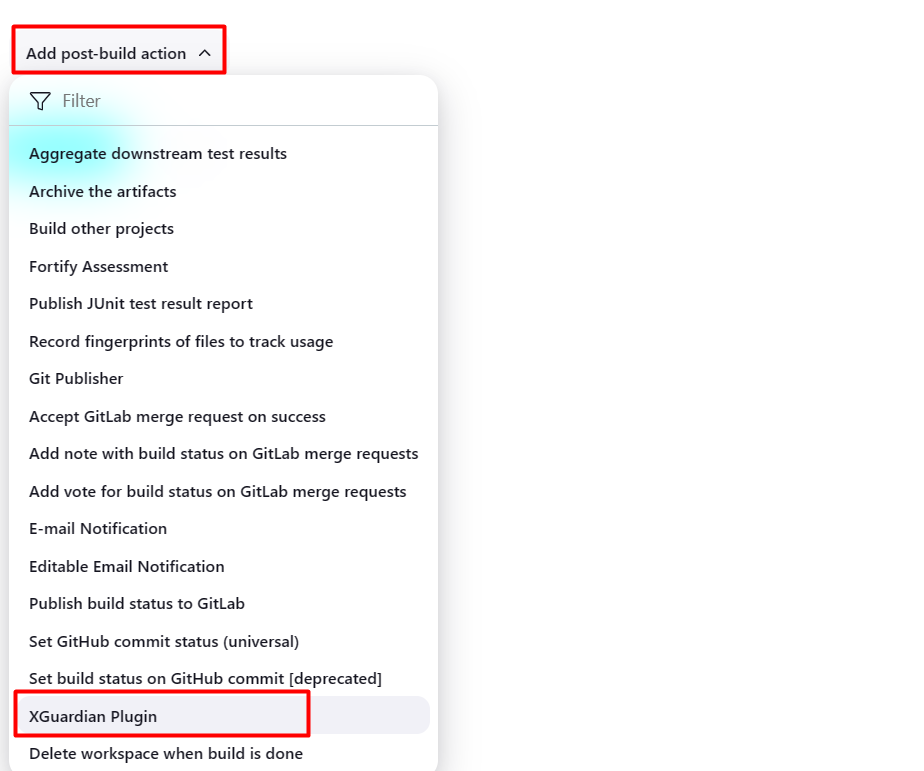
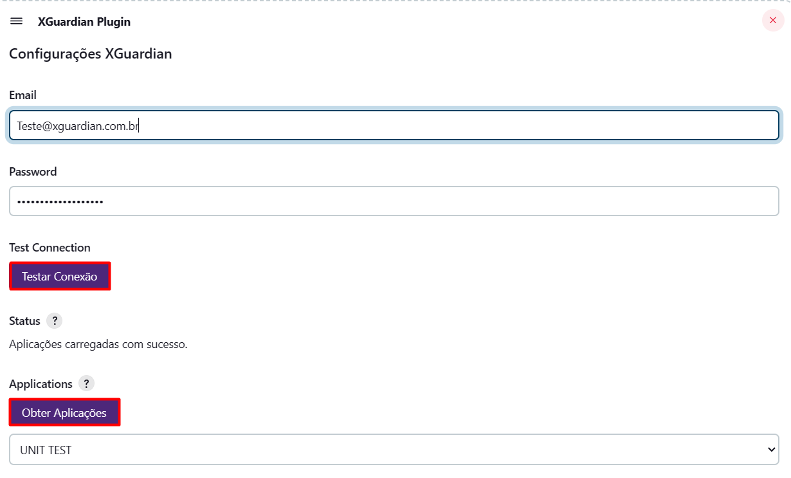
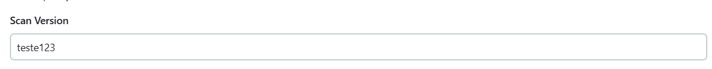
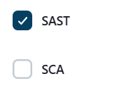
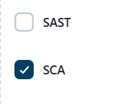
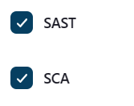
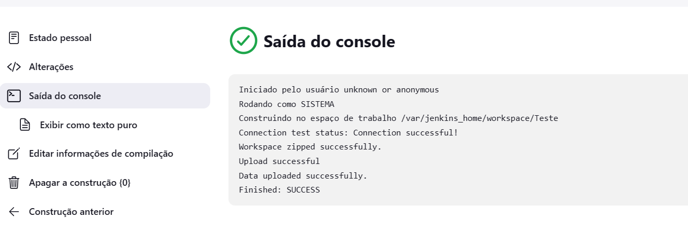

# Jenkins Xguardian Plugin Freestyle

A Jenkins plugin for automatically zip the workspace and upload the code for the Xguardian platform.

## Usage

To use the plugin up you will need to take the following steps in order:

1. [How to add in the pipeline freestyle](#1-add-to-the-pipeline-freestyle)
2. [Configure the plugin](#2-configure-the-plugin-required)
3. [Configure Scan version](#3-configure-scan-version-required)
4. [Select your type of scan](#4-select-your-type-of-scan-required)
5. [Start scan](#5-start-scan)

## 1. Add to the pipeline freestyle
    - Select the pipeline freestyle
    - Go to add Post-build action
    - Select Xguardian Plugin
 

## 2. Configure the plugin (Required)
    - Put email and password
    - Click test connection
    if you receive a successful connection
    - Click on Get Applications
    if you receive a faild connection
    - Check your credentials
    Always you change some parameter make the same steps above

## 3. Configure Scan version (required)

Always you make a new scan, need to change the Scan version, because Xguardian do not accept same scan versions.

## 4. Select your type of scan (required)
    - You have two checkbox Sast and Sca, you can select one or select both.
  

## 5. Start scan

    - If all the steps above have been configured, you can now run the pipeline.
    After running, this will be the pipeline screen after starting the scan.

## Issues

Xguardian Decide where you're going to host your issues, the default is Jenkins JIRA, but you can also enable GitHub issues,
If you use GitHub issues there's no need for this section; else add the following line:

Report issues and enhancements in the [Jenkins issue tracker](https://issues.jenkins.io/).

## Contributing

Xguardian review the default [CONTRIBUTING](https://github.com/jenkinsci/.github/blob/master/CONTRIBUTING.md) file and make sure it is appropriate for your plugin, if not then add your own one adapted from the base file

Refer to our [contribution guidelines](https://github.com/jenkinsci/.github/blob/master/CONTRIBUTING.md)

## LICENSE

Licensed under MIT, see [LICENSE](LICENSE.md)

